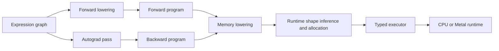

# TempLit

TempLit is an experimental C++20 machine-learning framework built around
compile-time expression graphs. It includes automatic differentiation, a
Metal runtime, a partial CPU backend, transformer components, AdamW training,
checkpointing, BPE tokenisation, and autoregressive text generation.

This is a toy project. It is not intended for production use, and large expression 
graphs can require substantial compiler time and memory.

## Features

- Lazy, strongly typed tensor expression graphs
- Compile-time forward and backward program generation
- Reverse-mode automatic differentiation
- Shape inference and explicit temporary tensor lowering
- Apple Metal kernels and command-buffer execution
- Multi-head causal attention, RMSNorm, GELU, embeddings, and linear layers
- Gradient clipping
- BPE tokeniser, token dataset loader, checkpoint archive, and text generation

## Requirements

- macOS with Xcode command-line tools and the Metal compiler
- CMake 3.20 or newer
- A C++20 compiler
- The `metal-cpp` Git submodule
- The GitHub CLI for the optional pre-generated release downloads

Initialise dependencies after cloning:

```sh
git submodule update --init --recursive
```

## Build

Configure an optimised Metal build without sanitizers:

```sh
cmake -S . -B build-metal \
  -DCMAKE_BUILD_TYPE=Release \
  -DGRAPH_TEST_BACKEND=METAL \
  -DGRAPH_ENABLE_SANITIZERS=OFF
cmake --build build-metal -j
```

The Metal library is compiled from `include/my_metal/math.metal` as part of
the build. The graph translation units are template-heavy, so `-j1` is
recommended on machines with limited memory.

Configure a CPU test build:

```sh
cmake -S . -B build-cpu \
  -DCMAKE_BUILD_TYPE=Release \
  -DGRAPH_TEST_BACKEND=CPU \
  -DGRAPH_ENABLE_SANITIZERS=OFF
cmake --build build-cpu -j
```

Sanitizers are enabled by default. Set `GRAPH_ENABLE_SANITIZERS=OFF` for
performance testing and profiling.

## Tests

```sh
ctest --test-dir build-metal --output-on-failure
```

Backend-independent tests use the backend selected by `GRAPH_TEST_BACKEND`.
Dedicated Metal tests cover runtime lifecycle, tensor operations, reductions,
attention primitives, embedding operations, gradient clipping, and AdamW.

## Expression System

Expressions are ordinary C++ objects whose types encode the operation tree.
They do not execute when constructed. `passes::compile` lowers an expression
into executable forward and backward programs.

```cpp
#include "expr/api.h"
#include "my_metal/metal.h"
#include "my_metal/runtime.h"
#include "optimiser/sgd.h"
#include "passes/compile.h"

using Mat = RTensor<metal::Metal, metal::kernel_type>;
using SGD = Optimiser::SGD<Mat>;

int main() {
  metal::init();
  {
    metal::Runtime runtime;

    expr::tensor::NoGradTensor<Mat> lhs(
        Mat::from_values({{1.0f, 2.0f}}));
    expr::tensor::NoGradTensor<Mat> rhs(
        Mat::from_values({{3.0f, 4.0f}}));

    auto graph = expr::add(lhs, rhs);
    auto compiled = passes::compile<Mat, SGD>(
        graph, runtime, SGD::generate_params(0.0f));

    compiled.prepare();
    Mat result = compiled.forward();
  }
  metal::shutdown();
}
```

`expr::let` explicitly evaluates a shared subexpression once and makes its
result available to multiple branches. This is used by decoder blocks to avoid
recomputing normalisation and residual values.

## Compilation Pipeline

`passes::Compiled` derives its execution structures from the expression type:

1. The autograd pass constructs the backward program.
2. Required forward values, inputs, indices, gradients, and saved paths are
   collected into typed path contexts.
3. Forward lowering inserts saves needed by the backward program.
4. Memory lowering assigns program paths to intermediate tensors.
5. `prepare()` binds runtime inputs, infers forward and backward shapes, and
   allocates saved values, gradients, and temporary tensors.
6. `forward()` and `backward()` dispatch the lowered programs through the
   selected runtime.

Input shapes are fixed after `prepare()`. Changing a shape requires another
call to `prepare()`.



## Automatic Differentiation

The reverse-mode autograd pass maps each differentiable expression to a typed
backward program. Forward values required by derivatives are saved by graph
path and read during backward execution. Parameter gradients and local
`expr::let` gradients use separate contexts, preventing internal values from
being treated as optimiser parameters.

A training iteration follows the conventional sequence:

```cpp
compiled.zero_grad();
Mat loss = compiled.forward();
compiled.backward(root_gradient);
compiled.step(1.0f); // global gradient-norm clipping
```

## Runtime Backends

Runtime operations receive destination tensors rather than allocating their
final outputs internally. The executor therefore controls persistent and
intermediate storage while the backend controls device-specific dispatch.

The Metal runtime records operations into a command buffer, compiles its
kernel library during the CMake build, and provides specialised kernels for
transformer training. The CPU runtime implements the common mathematical
subset used by backend-independent tests; it does not yet have feature parity
with Metal.

## Model Architecture

The included GPT example is a decoder-only causal transformer with:

- 2,048-token BPE vocabulary
- Maximum sequence length of 192 tokens
- 384-dimensional token and position embeddings
- Four decoder blocks
- Six attention heads per block
- Pre-normalisation with RMSNorm
- GELU feed-forward layers with a 4x hidden expansion
- Causal self-attention and residual connections
- Final RMSNorm and vocabulary projection

Training uses cross-entropy loss, fused AdamW updates, global gradient clipping,
learning-rate warmup, and cosine decay. The constants in `src/train.cpp`
control the current training configuration.

## Dataset

Train a 2,048-token BPE tokeniser and encode a text dataset:

```sh
cd build-metal
./train_bpe ../dataset.txt tokenise.bpe
./tokenise_dataset ../dataset.txt tokenise.bpe tinystories.tokens
```

Alternatively, download the pre-generated TinyStories assets from the
[dataset-v1 release](https://github.com/JTPuffer/TempLit/releases/tag/dataset-v1):

```sh
mkdir -p build-metal
gh release download dataset-v1 \
  --repo JTPuffer/TempLit \
  --pattern 'tinystories.tokens' \
  --pattern 'tokenise.bpe' \
  --dir build-metal
```

## Training

Run training from the build directory so the executable can locate the
generated Metal library:

```sh
cd build-metal
./train tinystories.tokens tokenise.bpe
```

Training reports mean training and validation loss. A checkpoint containing
model parameters and AdamW state is written under `checkpoints/` every 1,000
steps.

## Generation

The optional release also contains the trained example checkpoint. Download
it alongside the dataset assets:

```sh
gh release download dataset-v1 \
  --repo JTPuffer/TempLit \
  --pattern 'tiny_stories_model.bin' \
  --dir build-metal
```

Generate text with a prompt:

```sh
cd build-metal
./generate \
  "Once upon a time" \
  tokenise.bpe \
  tiny_stories_model.bin
```

Generation uses top-k sampling, a batch size of one, and a sliding 192-token
context. It recomputes the complete context for every token. Sampling can be
configured with optional arguments after the checkpoint path:

```sh
./generate \
  '"Please help me find my way home," said the little bird.' \
  tokenise.bpe \
  tiny_stories_model.bin \
  40 0.6 64 1
```

These final arguments are top-k, temperature, minimum generated length, and
random seed. Their defaults are `40`, `0.6`, `64`, and `1` respectively.

## Checkpoints

The archive format stores named byte records in a binary file. Compiled models
save parameter tensors and optimiser state into separate scopes. Loading
currently relies on the same model configuration and parameter traversal order
used when the checkpoint was created.


## Limitations

- Compilation cost grows quickly with expression-tree size.
- The CPU backend supports only a subset of the Metal runtime.
- Temporary tensors are allocated during `prepare()` without lifetime-based
  buffer reuse or an arena allocation plan.
- Training and inference share the same compiler path, so inference still
  instantiates autograd and optimiser machinery.
- Autoregressive generation has no KV cache or sampling strategies.

## Roadmap

- Add a forward-only inference compiler and KV caching.
- Plan temporary lifetimes and reuse Metal buffers.
- Add expression simplification and kernel fusion.
- Expand CPU feature parity and runtime conformance tests.
